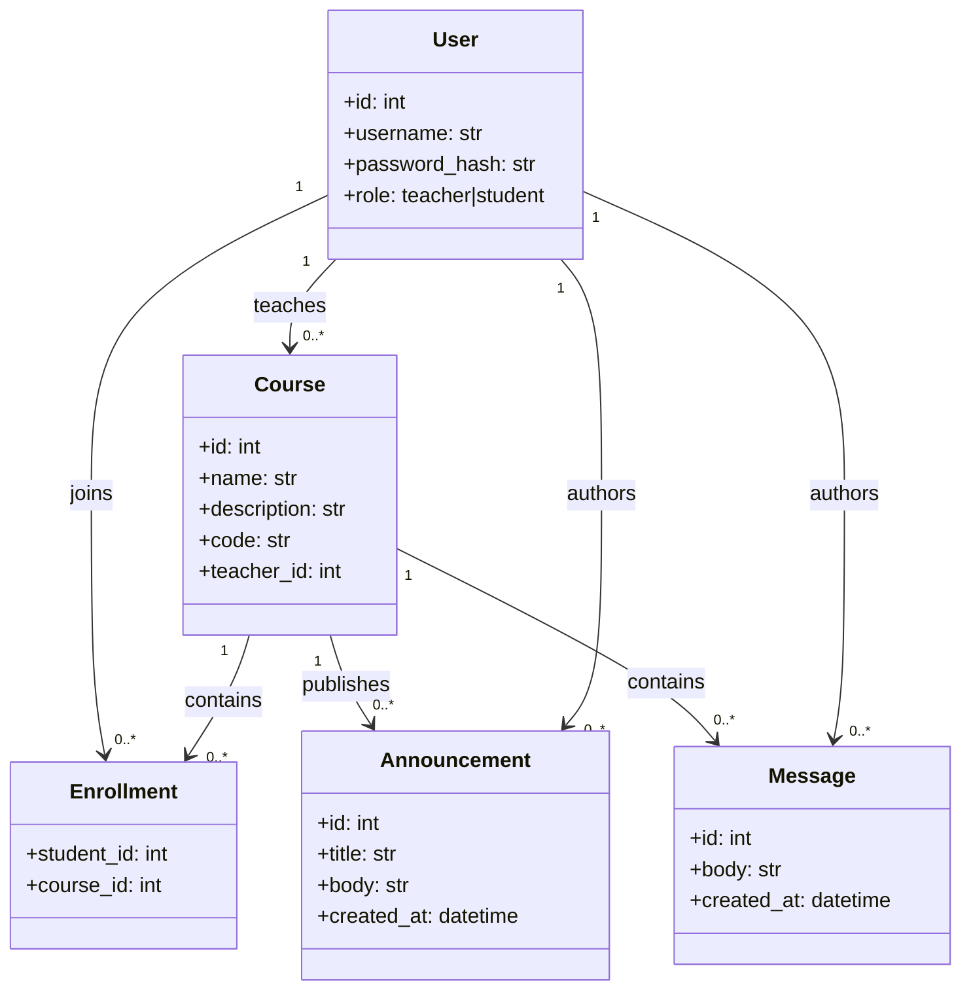
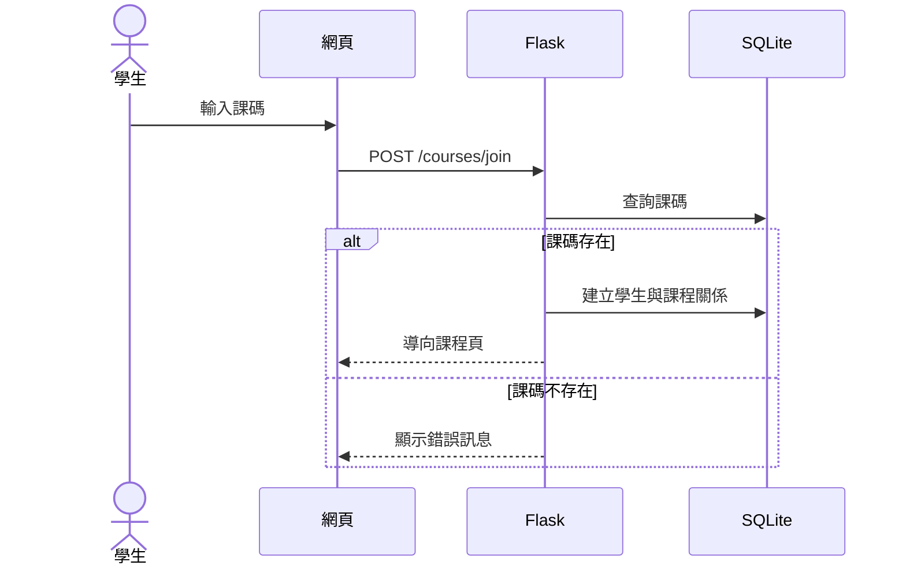

# Mini Moodle UML（本地草稿）

圖依 Jira 五個 Story 建立，尚待團隊確認需求邊界。GitHub 可直接呈現以下 Mermaid 圖。

## 類別圖

```mermaid
classDiagram
    class User {
      +id: int
      +username: str
      +password_hash: str
      +role: teacher|student
    }
    class Course {
      +id: int
      +name: str
      +description: str
      +code: str
      +teacher_id: int
    }
    class Enrollment {
      +student_id: int
      +course_id: int
    }
    class Announcement {
      +id: int
      +title: str
      +body: str
      +created_at: datetime
    }
    class Message {
      +id: int
      +body: str
      +created_at: datetime
    }
    User "1" --> "0..*" Course : teaches
    User "1" --> "0..*" Enrollment : joins
    Course "1" --> "0..*" Enrollment : contains
    Course "1" --> "0..*" Announcement : publishes
    User "1" --> "0..*" Announcement : authors
    Course "1" --> "0..*" Message : contains
    User "1" --> "0..*" Message : authors
```

## 學生加入課程循序圖

```mermaid
sequenceDiagram
    actor Student as 學生
    participant UI as 網頁
    participant App as Flask
    participant DB as SQLite
    Student->>UI: 輸入課碼
    UI->>App: POST /courses/join
    App->>DB: 查詢課碼
    alt 課碼存在
      App->>DB: 建立學生與課程關係
      App-->>UI: 導向課程頁
    else 課碼不存在
      App-->>UI: 顯示錯誤訊息
    end
```
